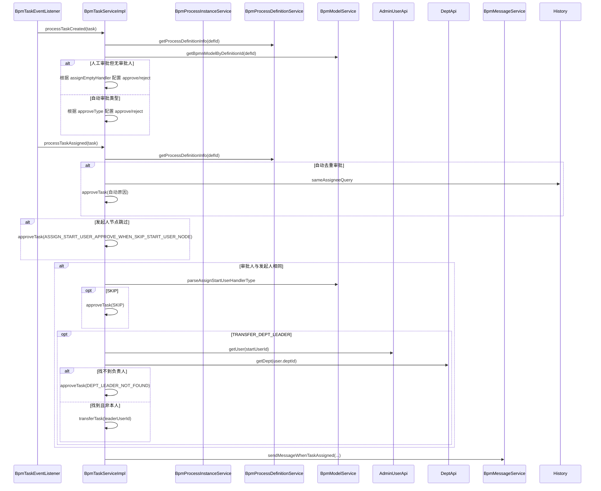

# 自动审批与分配策略时序图

代码位置：任务创建自动审批 `yudao-module-bpm/src/main/java/cn/iocoder/yudao/module/bpm/service/task/BpmTaskServiceImpl.java:1334`；任务分配后策略 `1438`

```mermaid
sequenceDiagram
  participant Listener as BpmTaskEventListener
  participant TaskSvc as BpmTaskServiceImpl
  participant ProcSvc as BpmProcessInstanceService
  participant DefSvc as BpmProcessDefinitionService
  participant Model as BpmModelService
  participant Admin as AdminUserApi
  participant Dept as DeptApi
  participant Msg as BpmMessageService

  Listener->>TaskSvc: processTaskCreated(task)
  TaskSvc->>DefSvc: getProcessDefinitionInfo(defId)
  TaskSvc->>Model: getBpmnModelByDefinitionId(defId)
  alt 人工审批但无审批人
    TaskSvc->>TaskSvc: 根据 assignEmptyHandler 配置 approve/reject
  else 自动审批类型
    TaskSvc->>TaskSvc: 根据 approveType 配置 approve/reject
  end

  Listener->>TaskSvc: processTaskAssigned(task)
  TaskSvc->>DefSvc: getProcessDefinitionInfo(defId)
  alt 自动去重审批
    TaskSvc->>History: sameAssigneeQuery
    TaskSvc->>TaskSvc: approveTask(自动原因)
  end
  alt 发起人节点跳过
    TaskSvc->>TaskSvc: approveTask(ASSIGN_START_USER_APPROVE_WHEN_SKIP_START_USER_NODE)
  end
  alt 审批人与发起人相同
    TaskSvc->>Model: parseAssignStartUserHandlerType
    opt SKIP
      TaskSvc->>TaskSvc: approveTask(SKIP)
    end
    opt TRANSFER_DEPT_LEADER
      TaskSvc->>Admin: getUser(startUserId)
      TaskSvc->>Dept: getDept(user.deptId)
      alt 找不到负责人
        TaskSvc->>TaskSvc: approveTask(DEPT_LEADER_NOT_FOUND)
      else 找到且非本人
        TaskSvc->>TaskSvc: transferTask(leaderUserId)
      end
    end
  end
  TaskSvc->>Msg: sendMessageWhenTaskAssigned(...)
```

