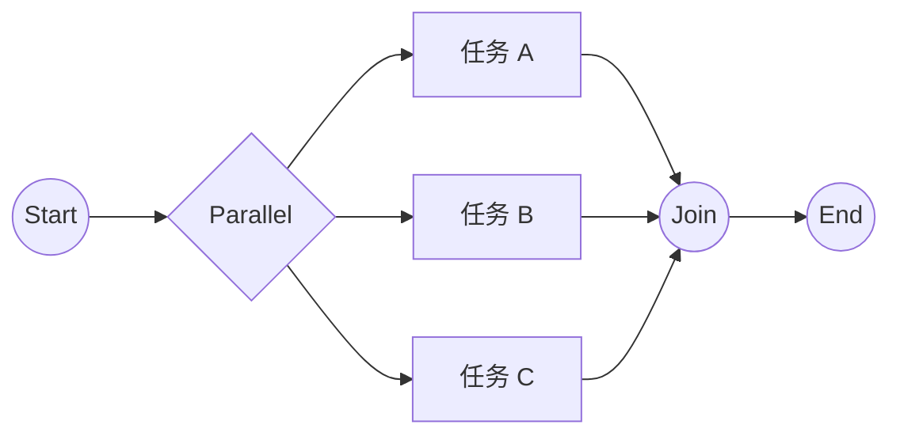
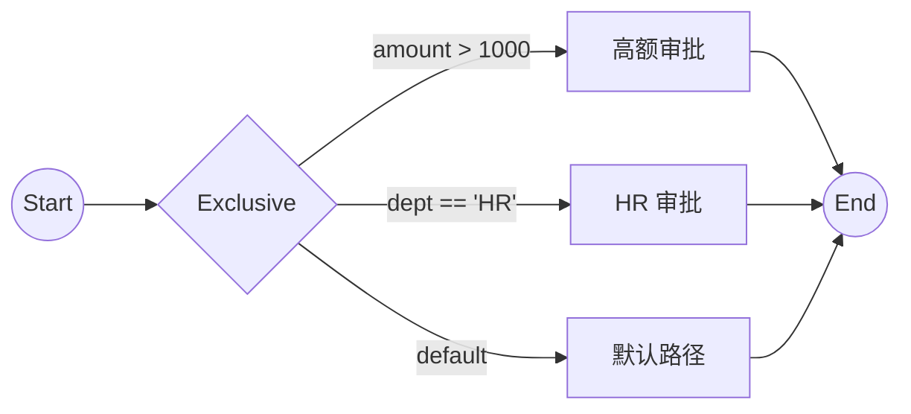
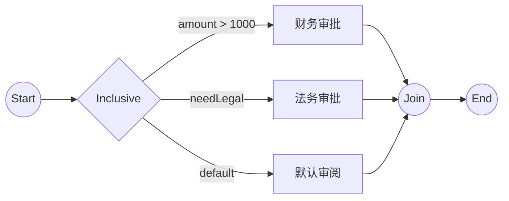

# 网关分支对比（Exclusive / Inclusive / Parallel）

## 概念与行为
- 并行网关（Parallel）：所有出口同时激活；不评估条件；在并行汇合处等待所有被选分支到达后继续
- 排他网关（Exclusive，条件分支）：只选择一个满足条件的出口；无匹配则走默认出口
- 包容网关（Inclusive，包容分支）：选择所有满足条件的出口（可多条）；无匹配则走默认出口；汇合处等待所有“被选出的分支”到达

## 时序与路由示意

并行网关（全部分支同时）

排他网关（单一路径满足条件）

包容网关（多条满足条件的路径）

## 表达式示例
- 排他网关：
  - `${amount > 1000}`、`${dept == 'HR'}`，若都不满足则走 `defaultFlow`
- 包容网关：
  - `${amount > 1000}` 与 `${needLegal}` 可同时满足，均会被选中；无满足则走 `defaultFlow`
- 并行网关：
  - 无条件，所有出口均被选择

## 代码关联
- 下一节点计算入口：[BpmnModelUtils.getNextFlowNodes](file:///Users/sgwood/code/ruoyi-vue-pro/yudao-module-bpm/src/main/java/cn/iocoder/yudao/module/bpm/framework/flowable/core/util/BpmnModelUtils.java#L872-L909)
- 排他路由选择：[handleExclusiveGateway](file:///Users/sgwood/code/ruoyi-vue-pro/yudao-module-bpm/src/main/java/cn/iocoder/yudao/module/bpm/framework/flowable/core/util/BpmnModelUtils.java#L963-L974)、[findMatchSequenceFlowByExclusiveGateway](file:///Users/sgwood/code/ruoyi-vue-pro/yudao-module-bpm/src/main/java/cn/iocoder/yudao/module/bpm/framework/flowable/core/util/BpmnModelUtils.java#L983-L996)
- 包容路由选择：[handleInclusiveGateway](file:///Users/sgwood/code/ruoyi-vue-pro/yudao-module-bpm/src/main/java/cn/iocoder/yudao/module/bpm/framework/flowable/core/util/BpmnModelUtils.java#L1006-L1016)、[findMatchSequenceFlowsByInclusiveGateway](file:///Users/sgwood/code/ruoyi-vue-pro/yudao-module-bpm/src/main/java/cn/iocoder/yudao/module/bpm/framework/flowable/core/util/BpmnModelUtils.java#L1026-L1040)
- 并行路由选择：[handleParallelGateway](file:///Users/sgwood/code/ruoyi-vue-pro/yudao-module-bpm/src/main/java/cn/iocoder/yudao/module/bpm/framework/flowable/core/util/BpmnModelUtils.java#L1051-L1060)
- 条件表达式求值：[evalConditionExpress](file:///Users/sgwood/code/ruoyi-vue-pro/yudao-module-bpm/src/main/java/cn/iocoder/yudao/module/bpm/framework/flowable/core/util/BpmnModelUtils.java#L1069-L1086)
- 退回可达性（并行分支排除）：[isSequentialReachable](file:///Users/sgwood/code/ruoyi-vue-pro/yudao-module-bpm/src/main/java/cn/iocoder/yudao/module/bpm/framework/flowable/core/util/BpmnModelUtils.java#L651-L689)

## 使用建议
- 并行适用于“同时进行”的多个任务；注意汇合等待可能导致阻塞
- 排他适用于“单路径决策”，务必设置默认路径避免条件未匹配
- 包容适用于“多条件可同时满足”，汇合等待的是“被选中”的分支
