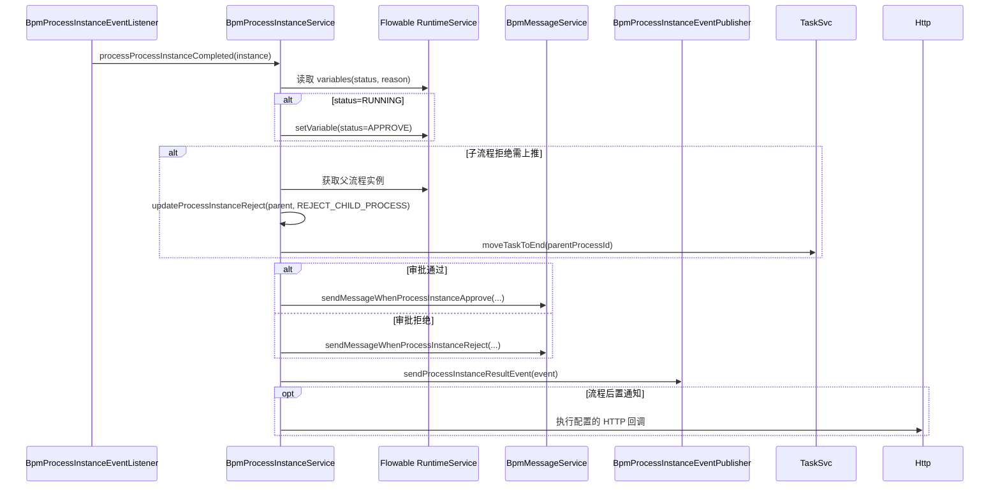

# 流程完成与事件时序图

代码位置：监听入口 `yudao-module-bpm/src/main/java/cn/iocoder/yudao/module/bpm/framework/flowable/core/listener/BpmProcessInstanceEventListener.java:47`；完成处理 `BpmProcessInstanceServiceImpl.java:966`

