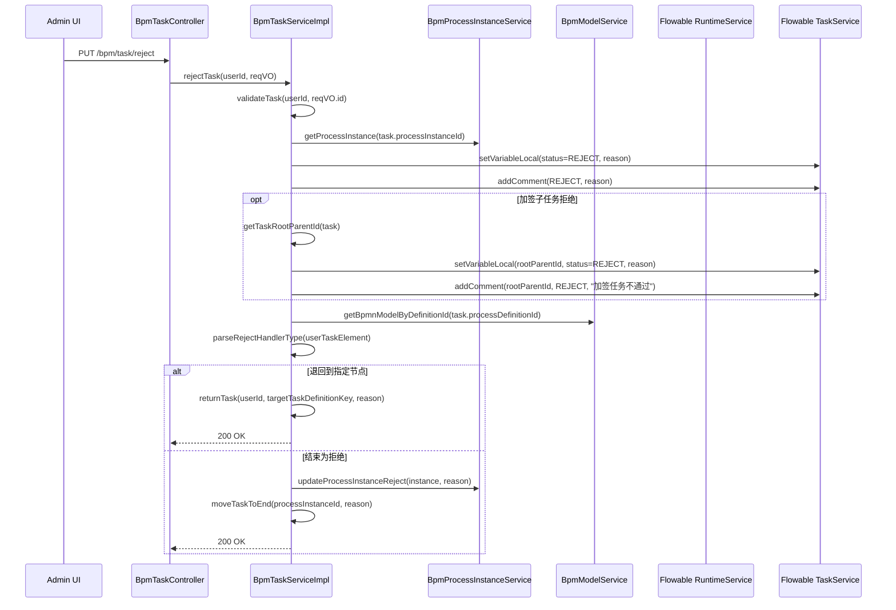

# 审批拒绝流程时序图

代码位置：`yudao-module-bpm/src/main/java/cn/iocoder/yudao/module/bpm/service/task/BpmTaskServiceImpl.java:797`

```mermaid
sequenceDiagram
  participant UI as Admin UI
  participant TaskCtl as BpmTaskController
  participant TaskSvc as BpmTaskServiceImpl
  participant ProcSvc as BpmProcessInstanceService
  participant Model as BpmModelService
  participant Runtime as Flowable RuntimeService
  participant Task as Flowable TaskService

  UI->>TaskCtl: PUT /bpm/task/reject
  TaskCtl->>TaskSvc: rejectTask(userId, reqVO)
  TaskSvc->>TaskSvc: validateTask(userId, reqVO.id)
  TaskSvc->>ProcSvc: getProcessInstance(task.processInstanceId)
  TaskSvc->>Task: setVariableLocal(status=REJECT, reason)
  TaskSvc->>Task: addComment(REJECT, reason)
  opt 加签子任务拒绝
    TaskSvc->>TaskSvc: getTaskRootParentId(task)
    TaskSvc->>Task: setVariableLocal(rootParentId, status=REJECT, reason)
    TaskSvc->>Task: addComment(rootParentId, REJECT, "加签任务不通过")
  end

  TaskSvc->>Model: getBpmnModelByDefinitionId(task.processDefinitionId)
  TaskSvc->>TaskSvc: parseRejectHandlerType(userTaskElement)
  alt 退回到指定节点
    TaskSvc->>TaskSvc: returnTask(userId, targetTaskDefinitionKey, reason)
    TaskSvc-->>TaskCtl: 200 OK
  else 结束为拒绝
    TaskSvc->>ProcSvc: updateProcessInstanceReject(instance, reason)
    TaskSvc->>TaskSvc: moveTaskToEnd(processInstanceId, reason)
    TaskSvc-->>TaskCtl: 200 OK
  end
```

