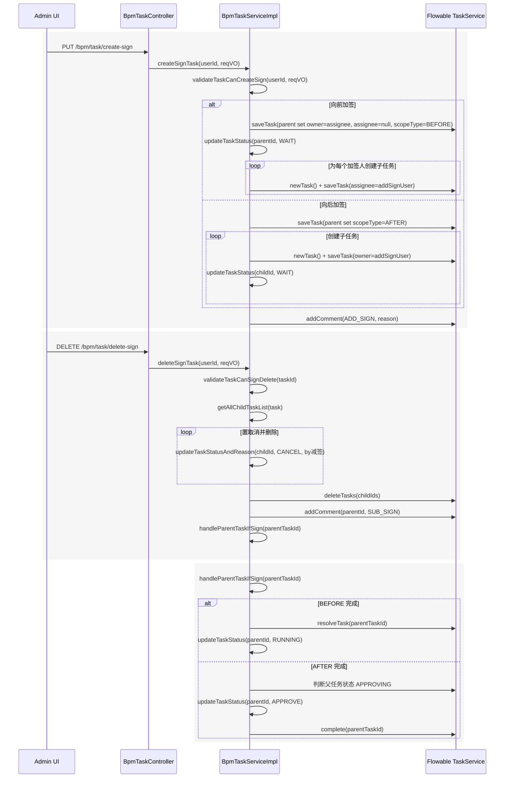

# 加签 / 减签时序图

代码位置：加签 `yudao-module-bpm/src/main/java/cn/iocoder/yudao/module/bpm/service/task/BpmTaskServiceImpl.java:1098`，减签 `1215`，父任务处理 `730`

```mermaid
sequenceDiagram
  participant UI as Admin UI
  participant TaskCtl as BpmTaskController
  participant TaskSvc as BpmTaskServiceImpl
  participant Task as Flowable TaskService

  rect rgb(245,245,245)
  UI->>TaskCtl: PUT /bpm/task/create-sign
  TaskCtl->>TaskSvc: createSignTask(userId, reqVO)
  TaskSvc->>TaskSvc: validateTaskCanCreateSign(userId, reqVO)
  alt 向前加签
    TaskSvc->>Task: saveTask(parent set owner=assignee, assignee=null, scopeType=BEFORE)
    TaskSvc->>TaskSvc: updateTaskStatus(parentId, WAIT)
    loop 为每个加签人创建子任务
      TaskSvc->>Task: newTask() + saveTask(assignee=addSignUser)
    end
  else 向后加签
    TaskSvc->>Task: saveTask(parent set scopeType=AFTER)
    loop 创建子任务
      TaskSvc->>Task: newTask() + saveTask(owner=addSignUser)
      TaskSvc->>TaskSvc: updateTaskStatus(childId, WAIT)
    end
  end
  TaskSvc->>Task: addComment(ADD_SIGN, reason)
  end

  rect rgb(245,245,245)
  UI->>TaskCtl: DELETE /bpm/task/delete-sign
  TaskCtl->>TaskSvc: deleteSignTask(userId, reqVO)
  TaskSvc->>TaskSvc: validateTaskCanSignDelete(taskId)
  TaskSvc->>TaskSvc: getAllChildTaskList(task)
  loop 置取消并删除
    TaskSvc->>TaskSvc: updateTaskStatusAndReason(childId, CANCEL, by减签)
  end
  TaskSvc->>Task: deleteTasks(childIds)
  TaskSvc->>Task: addComment(parentId, SUB_SIGN)
  TaskSvc->>TaskSvc: handleParentTaskIfSign(parentTaskId)
  end

  rect rgb(245,245,245)
  TaskSvc->>TaskSvc: handleParentTaskIfSign(parentTaskId)
  alt BEFORE 完成
    TaskSvc->>Task: resolveTask(parentTaskId)
    TaskSvc->>TaskSvc: updateTaskStatus(parentId, RUNNING)
  else AFTER 完成
    TaskSvc->>Task: 判断父任务状态 APPROVING
    TaskSvc->>TaskSvc: updateTaskStatus(parentId, APPROVE)
    TaskSvc->>Task: complete(parentTaskId)
  end
  end
```

