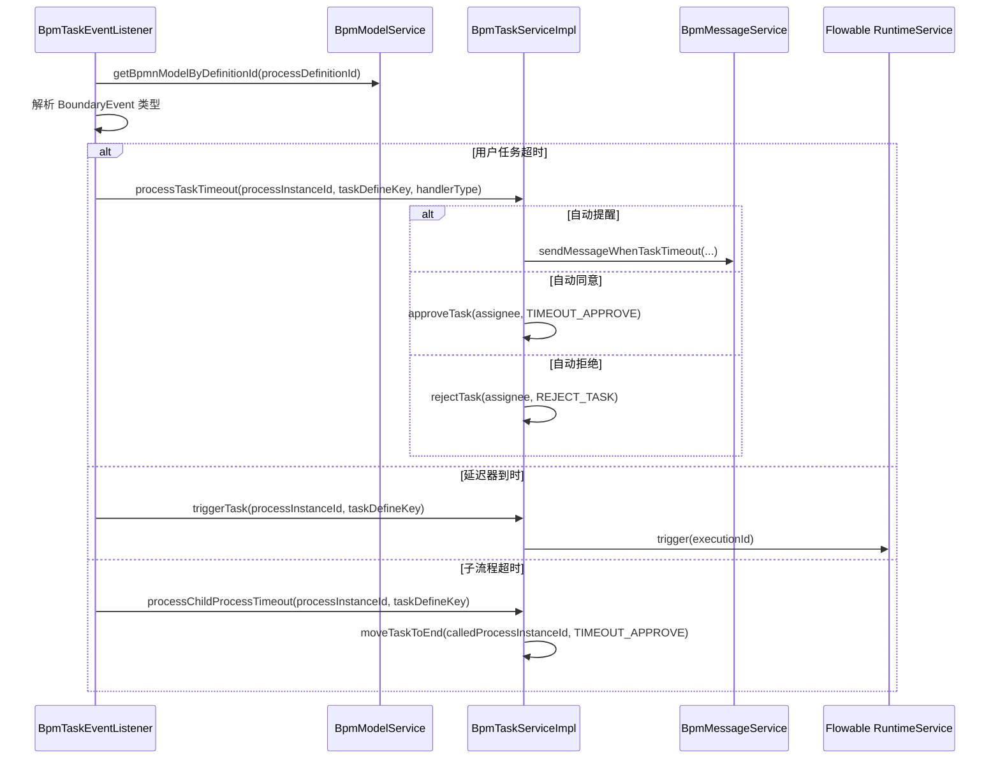

# 边界事件超时处理时序图

代码位置：监听入口 `yudao-module-bpm/src/main/java/cn/iocoder/yudao/module/bpm/framework/flowable/core/listener/BpmTaskEventListener.java:96`；处理 `BpmTaskServiceImpl.java:1596`、`1636`、`1645`

```mermaid
sequenceDiagram
  participant Listener as BpmTaskEventListener
  participant Model as BpmModelService
  participant TaskSvc as BpmTaskServiceImpl
  participant Msg as BpmMessageService
  participant Runtime as Flowable RuntimeService

  Listener->>Model: getBpmnModelByDefinitionId(processDefinitionId)
  Listener->>Listener: 解析 BoundaryEvent 类型
  alt 用户任务超时
    Listener->>TaskSvc: processTaskTimeout(processInstanceId, taskDefineKey, handlerType)
    alt 自动提醒
      TaskSvc->>Msg: sendMessageWhenTaskTimeout(...)
    else 自动同意
      TaskSvc->>TaskSvc: approveTask(assignee, TIMEOUT_APPROVE)
    else 自动拒绝
      TaskSvc->>TaskSvc: rejectTask(assignee, REJECT_TASK)
    end
  else 延迟器到时
    Listener->>TaskSvc: triggerTask(processInstanceId, taskDefineKey)
    TaskSvc->>Runtime: trigger(executionId)
  else 子流程超时
    Listener->>TaskSvc: processChildProcessTimeout(processInstanceId, taskDefineKey)
    TaskSvc->>TaskSvc: moveTaskToEnd(calledProcessInstanceId, TIMEOUT_APPROVE)
  end
```

